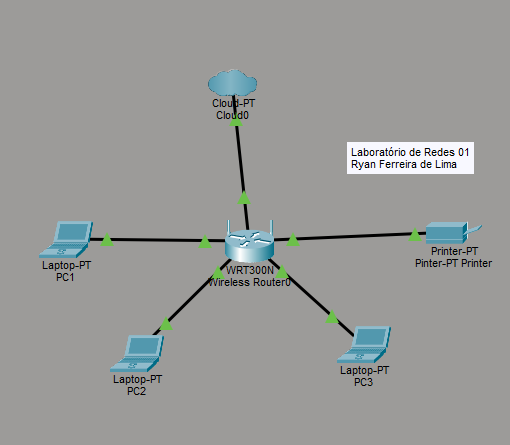

# Laboratório de redes 01 - Projeto de redes local

# -lab-redes-01

 Aluno: Ryan Ferreira de Lima 

 Data: 09/03/2026


 ----

 ## 1. Objetivo
 implantar uma rede local simples conectando 3 notebook a um roteador 
 wireless com switch em uma impressora 
 
 O projéto será dividido em duas etapas

 1. simulação da rede nop Cisco Packet tracer
 2. Implementação de rede no laboratório real

---

## 2. Equipamentos utilizados nestes laboratório: 

- 3 Notebook
- 1 roteador wireless com porta WAn e 4 portas
- 1 impressira de rede
- cabos de redes

 ---
 ## 3. Topologia da Rede

 Diagrama lógico da rede usada neste laboratório 
 ```mermaid 
graph TD

WAN[internet / WAN do provedor]

Router[Roteador wirelss<br>1 Porta WAN<br>4 Porta LAN]

PC1[Notbook 1]
PC2[Notbook 2]
PC3[Notbook 3]

Printer[Impressora de rede]

WAN --> |Porta WAN| Router
Router -->|LAN1| PC1
Router -->|LAN2| PC2
Router -->|LAN3| PC3
Router -->|LAN4| Printer
 
```

Imagem da topologia usada neste laboratório 


 
---

## 4. Plano de indereçamento de IP

Rede: 192.168.0.0/24

Gatewy: 192.168.0.1

| Dispósitivo | Tipo de IP | Endereço de IP | Observação |
|-------------|-------------|-------------|-------------|
| Roteador | Estático | 192.168.0.1 | IP dp Roteador |
| PC1 | Reserva DHCP | 192.168.0.4 | IP reservado pelo o roteador |
| PC2 | Automático | IP atribuído pelo roteador |
| PC3 | Automático | IP atribuído pelo roteador |

**Observação**

- A impressora e um dos notebooks utilizam reserva DHCP.
- O roteador sempre atribui o mesmo endereço de IP a esses dispositivos

  ---

## 5. Conclusão 

Este laboratório permitiu o funcionamento de uma rede local simples, incluindo:

- Estrutura de uma rede doméstica ou de pequeno escritório (rede local)
- Utilização de um roteador com porta WAN e porta LAN
- Funcionameto do DHCP
- Comunicação entre dispositivos na rede local
- Utilização de uma impressora de rede
- Compartilhando de pastas na rede usando Windows 
