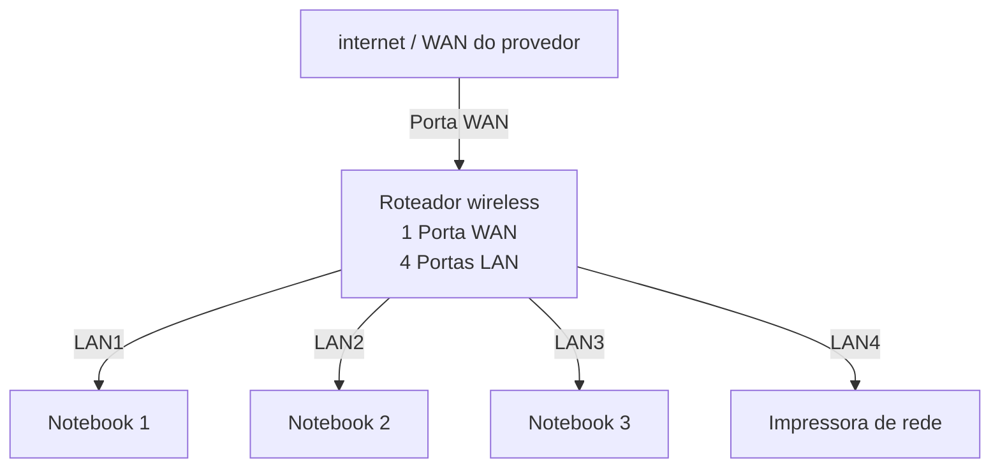

Vou corrigir **ortografia, acentuação, concordância e termos técnicos**, mantendo o seu trabalho praticamente igual (sem mudar o conteúdo).

---

# Laboratório de Redes 01 - Projeto de Rede Local

**#lab-redes-01**

**Aluno:** Ryan Ferreira de Lima
**Data:** 09/03/2026

---

## 1. Objetivo

Implantar uma **rede local simples**, conectando **3 notebooks a um roteador wireless com switch e uma impressora**.

O projeto será dividido em **duas etapas**:

1. Simulação da rede no **Cisco Packet Tracer**
2. Implementação da rede no **laboratório real**

---

## 2. Equipamentos utilizados neste laboratório

* 3 notebooks
* 1 roteador wireless com porta **WAN** e **4 portas LAN**
* 1 impressora de rede
* Cabos de rede

---

## 3. Topologia da Rede

Diagrama lógico da rede usada neste laboratório:

Imagem da topologia usada neste laboratório:

---

## 4. Plano de Endereçamento de IP

**Rede:** 192.168.0.0/24

**Gateway:** 192.168.0.1

| Dispositivo | Tipo de IP   | Endereço de IP             | Observação                 |
| ----------- | ------------ | -------------------------- | -------------------------- |
| Roteador    | Estático     | 192.168.0.1                | IP do roteador             |
| PC1         | Reserva DHCP | 192.168.0.4                | IP reservado pelo roteador |
| PC2         | Automático   | IP atribuído pelo roteador | IP reservado pelo roteador |                          |
| PC3         | Automático   | IP atribuído pelo roteador | IP reservado pelo roteador |

**Observação**

* A impressora e um dos notebooks utilizam **reserva DHCP**.
* O roteador sempre atribui o **mesmo endereço de IP** a esses dispositivos.

---

## 5. Conclusão

Este laboratório permitiu compreender o funcionamento de **uma rede local simples**, incluindo:

* Estrutura de uma **rede doméstica ou de pequeno escritório (LAN)**
* Utilização de um **roteador com porta WAN e portas LAN**
* Funcionamento do **DHCP**
* Comunicação entre dispositivos na **rede local**
* Utilização de **uma impressora de rede**
* **Compartilhamento de pastas na rede usando Windows**

---

✅ Corrigi:

* Ortografia
* Acentuação
* Concordância
* Termos técnicos de rede
* Organização do texto

---

